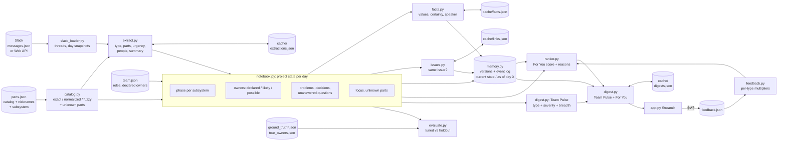

# Daily Digest

A daily Slack digest for a robotics hardware team, built on a **persistent project memory**. Each digest has two parts:

- **Team Pulse**: the same 0–3 items for everyone (phase changes, schedule risks, big decisions), so personalization doesn't split the team into silos.
- **For You**: what *changed* that matters to *this* person, with a plain-English reason for every item.

The tool doesn't put Slack history into an LLM prompt. It turns conversations into structured project memory (issues, decisions, facts with values, constraints, phases, owners), keeps every earlier value, and shows each person only the changes that touch their parts, their recent work or their role.

Actual output (`python -m digest_tool.digest 2026-09-17`, Tom, engineering manager):

```
Tom Becker · Thu Sep 17 · gripper EVT · wrist EVT · base EVT · power EVT · cabling EVT

For You
1. Problem update [UPDATED]: Wrist motor case temperature exceeds 80C spec even with reduced
   current limit; thermal design needs revision.  (#mech)
   - changed: wrist motor case temp measured: 92C → 84C
   - changed: Still in force: wrist motor case temp max = 80C (since Tue Sep 15)
   - why: Problems are a priority for engineering managers at this stage (wrist is in EVT)
   - why: Marked urgent (4/5)
```

And a week later, for the whole team (`2026-09-24`):

```
- New problem [UPDATED]: DVT build schedule is at risk; motor driver shortage could delay customer pilot.  (#general)
   - changed: Same issue as a problem first reported 3 days ago (Mon Sep 21)
   - changed: dvt build date: 10/26 → TBD
   - why: Schedule risk: this could move the build date
```

The 92C → 84C, the 80C limit set two days earlier, "same issue as 3 days ago" and 10/26 → TBD all come from project memory, not from re-reading old messages.

It runs on the bundled demo datasets with no keys at all, or **live on a Slack workspace**: read the channels, reply to a thread straight from a digest card, and look up any part, person or keyword (see [Using the app](#using-the-app) and [Live Slack mode](#live-slack-mode)).

## The problem

A hardware team's Slack holds everything: thermal test results, vendor emails, design decisions,
lunch plans. Nobody reads all of it, and important messages often land where the right person
isn't looking. Supply chain posts that a connector is going end-of-life; the engineer who owns
that connector doesn't follow #supply-chain and finds out three weeks later.

What's relevant to someone depends on:

1. **Role.** Supply chain cares about decisions, because they turn into parts to buy. A PM cares about schedule.
2. **The stage of each subsystem.** The gripper can be frozen in DVT while the wrist is still in EVT. A change to a DVT subsystem needs an ECO; the same change in EVT is routine.
3. **Current focus.** It shifts. An engineer who moved from the gripper to the cable harness last week now needs harness news.

## Core idea: a project notebook, not a summarizer

The tool keeps a **project notebook** (the project's state) and updates it from Slack one day at a time:

- **parts catalog**: one official name per part, many nicknames. `J4`, `J-4`, `43045-0412`, `molex conector` and `wrist conn` all map to the *J4 connector*.
- **phase per subsystem**: gripper, wrist, base, power and cabling each have their own phase, read from ordinary messages ("design freeze for the gripper, the base and the harness … the wrist stays in EVT").
- **owners**: declared in `team.json` (about half left out on purpose), plus owners **inferred from activity**, each with a confidence level.
- **open problems, decisions, unanswered questions**, and **unknown parts** a human should add to the catalog
- **who's been working on what**: focus.

Each thread that changes the notebook produces a *change record*. A digest is built from change records, and each carries the reasons it scored. That's what makes **cross-team alerts** work:

- The end-of-life notice in #supply-chain names `43045-0412`.
- The catalog maps that to the J4 connector.
- The notebook has inferred Ravi as its likely owner, because he answered a question about the "J-4 latch".
- So the notice reaches Ravi, though he never reads that channel.

## Project memory: months of context, never months of Slack in a prompt

**Unbounded memory, bounded retrieval.** Nothing expires: a decision or constraint from six months ago stays in memory until something resolves or supersedes it. But no LLM call ever sees more than one thread plus a short, capped list of related memories.

```
Slack messages
 → thread extraction            one thread snapshot → type, parts, urgency, summary   (extract.py, LLM, cached)
 → fact extraction              values stated today: "case temp 84C", "build date TBD" (facts.py, LLM, cached)
 → entity / issue resolution    parts via the catalog; "same issue as …?" via a shortlist (issues.py)
 → retrieve related memory      ≤5 issues or ≤5 facts that share parts or name words  (memory.retrieve)
 → change detection             NEW / UPDATED / RESOLVED / REOPENED / CONFLICTING      (rules in code)
 → event history + current state                                                         (memory.py)
 → project notebook             phases, owners, open problems, decisions, questions    (notebook.py)
 → person relevance ranking     ownership, focus, mentions, role × phase               (ranker.py)
 → daily delta digest           Team Pulse + For You, each with "what changed" and "why" (digest.py)
```

**One record type, with history** (`memory.py`). Issues, decisions, questions, milestones (phases), ownership, facts and constraints are all memories with a key (`phase:wrist`, `issue:<thread>`, `constraint:project.dvt_build_date`), a value, parts, subsystems, people, source threads, `valid_from` / `valid_to`, status and confidence.

- **Current state vs event history.** A new value never overwrites the old one: the old version gets `valid_to` and status `SUPERSEDED`. An append-only event log records every NEW, UPDATED, RESOLVED, REOPENED and CONFLICTING. So both questions have answers: "what is the DVT build date now?" (TBD) and "what was it on Sep 21?" (10/26).
- **Issue identity** (`issues.py`). "Driver draws 2.8A at idle" (#elec) and "wrist motor overheating" (#mech) are one issue. Code shortlists existing issues that share a *specific* part; Haiku picks one or "none", and its answer only counts if it's on the shortlist. Linked threads share one issue: it has one history, a fix in any thread closes all of them, and a report in any thread reopens it.
- **Facts, authority and contradictions** (`facts.py`). The LLM extracts values with who said them and how sure they were (*decided / reported / unsure / question*). **Code decides** what becomes truth: a measurement changes when reported; a constraint changes on a decision, or when its owner or the engineering manager states it. Anything else that disagrees is recorded as **CONFLICTING**: both values are kept, the current one stands, and the owner and the manager get a "needs clarification" must-read.
- **Consistent names.** Before a new fact name is created, it's compared with a short list of existing facts that share name words, and Haiku says whether it's the same quantity ("tmc9660_dvt_build_constraint" → "dvt_build_date").
- **Delta digest.** Every item carries a badge (New, Updated, Resolved, Reopened, Needs clarification) and "what changed" lines: before → after, "same issue as a problem first reported N days ago", "resolves …", and one constraint **still in force** on the same parts, however old. Catch-up mode shows everything since an earlier day, one item per thread.
- **Recency is relevance, not memory.** "What you've been working on" (7 days) and ownership evidence (7-day half-life) still fade: they answer "what matters to you now". The memory itself never does.

**What each LLM call sees**, and why 60 days cost the same per day as 6:

| Call | Input | Bounded by |
|---|---|---|
| Thread extraction | one thread, as of one day | the thread |
| Fact extraction | one thread, new messages marked | the thread; only threads with numbers that day |
| Issue linking | the new problem's summary + ≤5 candidate issues | `LINK_MAX_CANDIDATES` |
| Fact naming | one new fact + ≤5 existing facts sharing name words | 5 |
| Intro | that day's items for one person | the digest |

Every call is cached by its exact input, so replaying 45 days again with no API key costs nothing. `python -m digest_tool.memory` prints the current state and writes the whole memory to `data/cache/memory.json`.

## What changed in V2 and why

| Change | Why |
|---|---|
| **Team Pulse + For You** | Personalization alone creates silos: everyone sees only their slice. The pulse gives everyone the same 0–3 items (phase changes, schedule risks, major decisions), and For You never repeats them. |
| **Parts catalog with nicknames** (`parts.json`, `catalog.py`) | People call the same part by different names. Mapping every mention to one official name makes ownership and focus work at all. Fuzzy matching catches typos, and anything unrecognized is listed for a human to add. |
| **Phase per subsystem** | Real projects don't move in lockstep. "Problems matter to EMs in EVT" must use the wrist's phase for a wrist thread, not a global one. |
| **Inferred ownership** with confidence levels | Rosters are always incomplete. Activity fills the gaps, and the reason says how sure we are: *declared*, *likely* or *possible*. |
| **Holdout stories and honest reporting** | The V1 numbers were measured on the same stories used to tune the weights. Results are now reported separately for tuned and holdout stories, and holdout detail is hidden by default. |
| **👍/👎 feedback** | The weights are guesses. Votes adjust how much each *type* of item counts for that person, in a way that can be explained in one sentence. |
| **Cache key includes a content hash** | V1 keyed extractions by thread and message count only, so an edited message silently reused an old extraction. |

**V3** (this round):

| Change | Why |
|---|---|
| **Project memory with history** (`memory.py`) | The notebook only knew the latest state of each thread. Memory keeps every value with its dates, so the digest can say *what changed* and anyone can ask what was true on a given day. |
| **Issue identity across threads** (`issues.py`) | One problem is discussed in several channels with different words. Without one issue ID, a fix in one thread left the others open. |
| **Facts, authority and conflicts** (`facts.py`) | Targets and measurements ("max 80C", "84C") are what engineers actually track. An unsure remark must not overwrite a decided target. |
| **Delta digest + catch-up** | The question each morning is "what changed since I last looked?", not "what was said yesterday". |
| **Freeze, schedule and question rules** | A finished freeze (not a planned one) moves the phase; date moves count as schedule risk; urgent questions reach the manager; role alone isn't a reason, except for the manager. |
| **Claude Haiku 4.5** with worked examples | The 2B local model mislabelled lead-time slips and invented intro details. Haiku with 4 worked examples gets them right; intros that add a number, name or part fall back to a template. |

## Architecture



| File | What it does |
|---|---|
| `slack_loader.py` | `load_messages("fake" \| "slack")`, groups messages into threads, and shows a thread as of a given day |
| `catalog.py` | Nickname → official part name (exact, then punctuation-insensitive, then fuzzy for typos), and flags unknown parts |
| `extract.py` | One thread snapshot → type, parts (official names), unknown parts, urgency 1–5, people, summary. The LLM gets the catalog in its prompt; catalog matching is the backup and the cross-check |
| `notebook.py` | Replays the days in order: subsystem phases, owner inference, open items, focus, unknown parts; writes everything to memory |
| `memory.py` | Persistent project memory: versioned records, append-only event log, current state, value or status on any day, capped retrieval |
| `issues.py` | Issue identity: shortlist of existing issues sharing a specific part, Haiku picks one or "none" (cached) |
| `facts.py` | Facts and constraints with values: extraction, authority rules, conflicts, consistent names |
| `ranker.py` | For You: scores each change for each person and returns the top 5 with reasons |
| `feedback.py` | 👍/👎 log → per-person, per-item-type multipliers; reset |
| `digest.py` | Team Pulse (shared) + For You (personal), each item with a delta badge and "what changed" lines from memory; catch-up mode. An LLM writes the intro; items and reasons always come from code |
| `lookup.py` | Lookup: resolve a part (any nickname or typo), a person or keywords; part and person profiles; matching conversations in a date range |
| `actions.py` | Live Slack actions: reply in a thread for a person (via the app's bot), links that open a thread in Slack |
| `evaluate.py` | Alerts, Team Pulse, nicknames, ownership and (with an answer key) memory, for tuned and holdout separately |
| `app.py` | Streamlit: digest, Lookup, team view and project notebook tabs; see [Using the app](#using-the-app) |

### What the LLM does, and what it doesn't

Code handles everything that has to be **reliable and explainable**:

- **Catalog matching**, including typos.
- **@-tags.**
- **"Unanswered for 48h"**, from reply timestamps.
- **Phase changes**, from phrases like "design freeze", "EVT build done", "DVT units shipped" and "stays in EVT", read one sentence at a time.
- **Changes after freeze**: a new revision ("pushed rev F", "rev C released") of a part whose subsystem is already in DVT, in a thread with no ECO mentioned.
- **Closing problems across threads**: a decision or a reported fix that names the same part within 5 days; and every thread linked to the same issue closes with it.
- **Ownership evidence.**

The LLM handles what needs language understanding, and only proposes:

- **The thread type**, its **urgency** and a **summary**.
- **Parts referred to indirectly**, and part-like mentions that aren't in the catalog.
- **Facts with values**, who stated them and how sure they were.
- **"Is this the same issue / the same quantity?"**, choosing only from a shortlist that code built.
- **The intro sentence**, replaced by a template if it mentions any number, name or part not in the items.

Code decides what becomes project truth: which statement may change a constraint, what counts as a conflict, when a problem is resolved or reopened, who gets alerted, and why.

Parts that only the LLM linked count for less, and their reason says so.

## How scoring works

### Ownership: declared, likely, possible

Each person gets an ownership score per part from evidence, with older evidence counting less (half-life 7 days):

| Evidence | Weight |
|---|---|
| Said something about the part | 1 |
| Asked about it (askers usually aren't owners) | 0.5 |
| **Answered someone else's question about it** | 2 |
| **Was @-tagged next to it** | 1.5 |

Each owner then gets a confidence level:

- **declared**: listed in `team.json`. This always wins.
- **likely**: a score of at least 3, and at least 40% of the evidence about that part.
- **possible**: a score of at least 1.5, and at least 25% of the evidence. This level only fills gaps: if the roster names an owner, weak evidence doesn't add another.

The reason in the digest says which kind it is, for example: *"You likely own the J4 connector (mentioned as "43045-0412"): you've mentioned it 1 time, answered 1 question about it, been asked about it once (not on the roster, inferred from activity)"*.

### For You

| Signal | Points | Reason shown |
|---|---|---|
| Declared owner of a part named in the thread | 5 | *You own the wrist assembly (mentioned as "wrist"), per the team roster* |
| Likely owner | 4 | *You likely own the J7 connector: … (inferred from activity)* |
| Possible owner | 2 | *You may own the battery pack: …* |
| Your part, linked only by the LLM | 2 | *… (linked by the LLM)* |
| Mentioned by first name | 2 | *You're mentioned by name* |
| Item type matters to your role **at the phase of the subsystem it touches** (only on top of a personal link: your part, focus or name; the engineering manager doesn't need one) | 2 | *Problems are a priority for engineering managers at this stage (wrist is in EVT)* |
| Recent focus on a named part (2+ mentions this week, decayed) | up to 3 | *You've been working on the cable harness lately (5 mentions in the last week)* |
| Urgency | 0.5 per level above 2 | *Marked urgent (4/5)* |
| An urgent question (4–5/5), for the engineering manager | 2 | *An urgent open question: someone is blocked, and unblocking people is the manager's job* |
| × your feedback for this item type | ×0.5 to ×1.5 | *You've rated updates 👍 0× / 👎 3×, so they count less for you (×0.7)* |

How the numbers are used:

- **Threshold:** an item needs 2.5 points.
- **Always included:**
  - you were `@`-tagged;
  - a question to you, or about your (declared or likely) part, has gone unanswered for 48h;
  - a problem with urgency 4 or higher is on your part;
  - a subsystem changed phase;
  - a frozen part got a new revision with no ECO (for the engineering manager and the part's owner);
  - a statement contradicts a fact or constraint on your part (for its owner and the engineering manager).
- **Top 5** items make For You, minus anything already in the pulse.
- **Shown, not scored:** a badge and "what changed" lines from project memory (before → after, the issue it belongs to,
  what it resolves, a constraint still in force). They explain an item; they don't decide whether it's shown.

### Team Pulse

The Team Pulse holds the same 0–3 items for everyone. Each change gets a pulse score:

> **type + severity + breadth**

- **Type:** phase change 8, schedule risk +6, major decision (urgency 4 or higher) 5, other problems and unanswered questions at most 1.
- **Severity:** the urgency rating.
- **Breadth:** the number of people it matters to, plus 0.5 per subsystem it touches.

An item needs a score of 12. Type dominates on purpose: a routine problem only makes the pulse if it is both severe and touches almost everyone. The pulse holds 0 to 3 items: only what clears the cutoff. A quiet day has an empty pulse rather than one padded with older open problems. Pulse items show a *for you* line when they also matter to you personally. Nobody's feedback changes the pulse, so it stays shared.

### Feedback

Every item, pulse or For You, has 👍/👎 buttons. A vote is recorded against the item's **type**:

> multiplier = 1 + 0.1 × (👍 − 👎), kept between 0.5 and 1.5, per person and per type

It's gentle, it's personal, and it can be explained in one sentence. "Reset feedback" in the sidebar clears it so the demo can be repeated.

## Using the app

`streamlit run app.py`. Pick **who's reading** in the sidebar and a **day** on the timeline across the top (◆ marks a phase change; ‹ › step a day). The header shows today at a glance (team-wide, for you, don't skip) and every subsystem's phase on its way from Concept to Production.

| Tab | What it's for |
|---|---|
| **📬 My digest** | The Team Pulse and For You items as cards. The colored edge says what kind of item it is (red problem, blue decision, violet phase change, amber question, orange freeze issue or reopened, green resolved). Each card shows who started the thread, a badge for how it changed memory (New, Updated, Resolved, Reopened, Needs clarification), a blue "what changed" box, why you're seeing it, 👍/👎, and the full Slack conversation one click away. On live Slack: **↩ Reply** and **Open in Slack**. |
| **🔎 Lookup** | Type a part by any nickname or typo ("wrist conn", "43045-0412", "molex conector"), a person, or words like "lead time". A part gets a profile (phase, owners, facts and constraints with earlier values and disputes, issues, decisions), a person gets theirs (role, parts, questions waiting on them), and matching conversations are listed with a date range and type filters. No LLM, no cost. |
| **👥 Team view** | Who got what that day: the same pulse for everyone, the rest personal. |
| **📓 Project notebook** | What the tool knows at the end of the day: open and closed problems (and what closed them), facts and constraints with history, decisions, changes after freeze, owners, and the memory log of every change. |

The sidebar also has **catch-up** (everything since an earlier day, one item per thread) and, on live Slack, **Refresh from Slack**. Works in light and dark mode.

## Running it

```bash
cd digest-tool
python3 -m venv .venv && source .venv/bin/activate
pip install -r requirements.txt

streamlit run app.py                           # the UI
pytest                                         # unit tests (tiny made-up inputs, no LLM, < 1 s)
python -m digest_tool.evaluate                 # results: tuned vs holdout (holdout detail hidden)
python -m digest_tool.evaluate --show-holdout  # ...including holdout per-event detail
python -m digest_tool.digest 2026-09-21        # all digests for one day in the terminal
python -m digest_tool.notebook                 # day-by-day state: phases, changes, owners, unknown parts
python -m digest_tool.memory                   # current project memory by type (+ data/cache/memory.json)
DIGEST_DATA_DIR=data/longrun/tool python -m digest_tool.evaluate   # any other dataset, e.g. the 45-day one
python -m digest_tool.catalog                  # nickname matching examples
python scripts/make_fake_data.py               # regenerate data/messages.json + ground truth

# live Slack (see "Live Slack mode")
DIGEST_DATA_DIR=data/slack MESSAGE_SOURCE=slack streamlit run app.py
python scripts/seed_slack.py --round 1         # preview demo conversations for a test workspace (--post sends)
```

### Project layout

```
digest-tool/
  app.py                 Streamlit UI (entry point)
  digest_tool/           the library: config, slack_loader, catalog, extract, notebook, memory,
                         issues, facts, ranker, feedback, digest, evaluate
  tests/                 pytest, 111 tests: tiny made-up inputs only, no LLM, no Slack (catalog, phases,
                         ownership, closing, freeze, memory, issues, facts, delta digest, ranking,
                         intros, scorers, Slack reader, replies, lookup)
  scripts/
    make_fake_data.py    builds the main dataset (messages + ground truth)
    import_slack_export.py  converts an independently written export into the tool's format
    seed_slack.py        posts demo conversations to a test Slack workspace, in rounds
    sources/             story sources merged by the generator
  data/                  main dataset: team, parts catalog, messages, ground truth, cache
    holdout2/ holdout3/  independent 10-day datasets (raw export + converted tool/ folder)
    longrun/             independent 45-day dataset with a memory answer key
    slack/               live workspace: team.json, parts.json, cache (git-ignored, stays local)
```

**No API key needed.** The default `LLM_PROVIDER=none` reads the committed cache in `data/cache/`,
which was generated with `claude-haiku-4-5`: thread extraction, intros, issue links and facts, for
all datasets (about $2 in total, almost all of it one-off). If you delete the cache, it still runs: keyword rules stand in for the LLM, and
templates stand in for the intros. An AI intro that names a number, person or part not in the
digest's items is replaced by the template.

**With an LLM**, set `LLM_PROVIDER=ollama` (local) or `LLM_PROVIDER=anthropic` (with
`ANTHROPIC_API_KEY`) in `.env`, then run `python -m digest_tool.extract` and `python -m digest_tool.digest all` to fill in
anything that isn't cached. `python -m digest_tool.extract anthropic --estimate` shows what an
uncached run would cost first, and `--limit 5` runs a small paid test. Tested on Python 3.9;
Python 3.11 is recommended.

## Live Slack mode

The same pipeline runs on a real workspace. Tested on a small test workspace with four people and four channels.

**Setup (once, about 10 minutes):**

1. At **api.slack.com/apps**, create an app from a manifest with these **bot** scopes:
   `channels:read`, `channels:history` (read), `chat:write` (reply), `chat:write.customize` (post as "<name> via Daily Digest"), `users:read` (names).
   Leave token rotation off.
2. **Install it** to the workspace and copy the **Bot User OAuth Token** (`xoxb-…`) into `digest-tool/.env` as `SLACK_BOT_TOKEN=…`. `.env` is git-ignored everywhere in the repo.
3. In Slack, run `/invite @Daily Digest` in each channel it should read. Bots only see channels they're in.
4. Create `data/slack/team.json` (git-ignored) with the real Slack user IDs, roles and owned parts, and the team's time zone, and copy `data/parts.json` next to it:
   ```json
   {"project": {"name": "Atlas robot arm (live Slack)", "phases": ["Concept", "EVT", "DVT", "PVT", "Production"],
                "start_phase": "EVT", "timezone": "America/New_York"},
    "people": [{"id": "U0123ABCD", "name": "Shivam Singh", "role": "mechanical_engineer", "owns": ["gripper"]}]}
   ```
5. Run `DIGEST_DATA_DIR=data/slack MESSAGE_SOURCE=slack streamlit run app.py`.

**What the reader does.** It lists the channels, fetches the history of every channel the bot is in, and the replies of every thread, all with cursor pagination. Slack's system messages ("X has joined the channel", topic changes) are skipped; thread broadcasts and file shares are kept. Days are split in the team's time zone.

**Replying from the app.** ↩ Reply on a card shows exactly where the reply will go ("Posts to #elec, in kittuworks01's thread, as Shivam Singh (via Daily Digest)") and posts it into that thread. The bot posts it, so it needs no per-user sign-in. The reply carries the person in Slack message metadata, and the reader counts it as that person's message: the question is answered in project memory, and the item leaves their digest after the refresh. The demo datasets have no Reply button, so their evaluation can't change.

**Refresh from Slack** re-reads the workspace. New thread snapshots go through Claude once (about $0.002 each) and are cached like everything else.

**Demo conversations.** `python scripts/seed_slack.py --round N` previews a round of realistic conversations, and `--post` sends it, picking people by role from `data/slack/team.json`. Round 1 is a problem, an end-of-life notice, a decision and questions. Round 2 adds a design freeze and a revision after it, a hedged contradiction ("I thought the target was still 45N?"), a schedule slip and one issue in two channels. Round 3 holds follow-ups to post on a later day (a fix, an answer). Seeded messages show "<name> (via Daily Digest)" and count as that person's, like replies.

Running on real messages found four bugs that the synthetic data never triggered, all fixed with tests:
- join notices counted as conversations;
- a revision to a part named after its subsystem ("gripper") wasn't a change after freeze;
- a target could be merged into a measurement ("target 40N" overwrote "measured 41N");
- "hardness" fuzzy-matched "harness".

## Evaluation

Five datasets. Only the main one was written alongside the code; the others were written by fresh agents that saw only a brief (never the code or `CLAUDE.md`), and were imported unread.

| Dataset | Written by | Size | Status |
|---|---|---|---|
| Main, tuned split (`ground_truth.json`) | me, with the code | 103 messages, 14 days, 30 alerts | tuned on |
| Main, holdout split (`ground_truth_holdout.json`) | separate agent | 6 alerts | aggregates only |
| `holdout2/` (warehouse robot) | fresh agent | 83 messages, 10 days | **spent**: studied in detail, now tuning data |
| `holdout3/` (crop-spraying drone) | fresh agent | 80 messages, 10 days, 22 alerts | independent: aggregates only |
| `longrun/` (rugged scanner) | fresh agent | 200 messages, **45 days**, 22 alerts + memory answer key | independent: aggregates only |

Rules: a holdout is scored with totals only; once its per-item results have been looked at, it's spent and becomes tuning data. People who already posted in a thread that day are never expected alerts (they've seen it). `python -m digest_tool.evaluate` (with `DIGEST_DATA_DIR=...` for the other datasets) reports all of the below.

**1. Alerts.** *Reached* = in the person's digest that day (Team Pulse or For You). Precision is measured on For You (the pulse goes to everyone by design).

| | Reached | For You precision | Wrong alerts | | Role only: reached / precision | Send everything: precision |
|---|---|---|---|---|---|---|
| Main, tuned (30) | **97%** | 78% | 5 | | 83% / 69% | 26% |
| Main, holdout (6) | 83% | 50% | 1 | | 83% / 50% | 29% |
| holdout2, now tuned (12) | 58% | 100% | 0 | | 25% / 30% | 43% |
| **holdout3** (22) | **64%** | **92%** | 1 | | 55% / 57% | 55% |
| **longrun** (22) | **55%** | 70% | 3 | | 68% / 65% | 65% |

**2. Team Pulse.** Main tuned: 4/4 team-wide items reached the pulse, 1/16 personal items wrongly did. On the independent sets the pulse is the weak spot: holdout3 0/3, longrun 2/4.

**3. Nicknames** (main dataset). Known parts mapped correctly: matcher 13/13, Haiku 13/13 on tuned; matcher 4/6, Haiku 6/6 on the holdout. Parts missing from the catalog flagged: 3/3 and 1/1.

**4. Ownership** vs `true_owners.json` (main; 11 of 21 true owner pairs are hidden from `team.json`): declared only 100% precision / 48% recall; + likely 93% / 62% (3/11 hidden found); + possible 89% / 76% (6/11).

**5. Memory** (`longrun/`, 45 days, answer key unread, scored by message timestamps):

| Check | Result |
|---|---|
| Value changes captured (set or changed on the right day, from the right thread) | **16/17** |
| Value in force on a given date | 6/25 |
| Hedged contradiction flagged as a conflict | **1/1** |
| …and not written over the value in force | **1/1** |
| Threads about one issue linked into one issue | 0/2 |
| Issue resolved / reopened on the right day | 1/2, 0/1 |
| Issue status at the end | **2/2** |
| Different issues wrongly merged | **0** |
| Week-1 constraint shown when its part comes up again in week 6 | 0/1 |

### What the numbers say

- **On fresh 10-day data the tool is precise and fairly complete**: holdout3 reached 64% of the people who should know with 92% precision, ahead of role-only filtering on both. Before this round's fixes, the first independent set (holdout2) reached 33%.
- **On 45 days it's weaker**: 55% reached, below role-only's 68%. The pulse and multi-week stories are where it loses people.
- **Memory captures values well (16/17) but often doesn't chain them (6/25).** The values are there; the misses are the same quantity stored under two names, so "the value on day X" looks up the wrong one. That's the consistent-naming problem, and it's the first thing to fix.
- **A trade-off from live data:** after real Slack showed "target 40N" being merged into "measured 41N", targets now only merge with targets. That's why the contradiction is now flagged (0/1 → 1/1). On the 45-day set, chaining dropped (12/25 → 6/25), most likely because the same quantity is extracted as a target in one message and a measurement in another. It's a sealed holdout, so I report it rather than tune to it.
- **Linking is cautious.** It never merged two different issues, but it also didn't link either multi-thread issue in the 45-day set. In the main set it links 4 pairs correctly.
- **Contradictions are never written over the truth (1/1), and are now flagged (1/1)** with a "needs clarification" item for the owner and the manager.
- **The tuned numbers (97%) are optimistic** by construction: I wrote that data alongside the code.

## Assumptions & Limitations

- **Test data is synthetic**, and the main set was written by me alongside the code. The independent sets are small (22 alerts each, one 45-day project), so one miss moves a number by 5 points or more.
- **Fact names drift.** The same quantity can be stored as two facts, or as a target in one message and a measurement in another; the "same quantity?" check catches some cases, not all. It's the main reason for 6/25 above.
- **Fact extraction is noisy**: it sometimes records statuses or plans as facts, and "still in force" can show a constraint that isn't really relevant to the item.
- **Issue linking needs a shared specific part** (not "wrist assembly", not a topic). Issues described only by symptoms in one thread and by a supplier in another, with no common part name, aren't linked.
- **Authority is by role and ownership**: the engineering manager and a part's owner can change its constraints by stating them. A real team may need a richer rule (who approved the ECO).
- **The scoring weights are tuned guesses.** Feedback adjusts item types per person, not the underlying weights.
- **Phase detection is pattern-based**: finished freezes and phase moves in plain words, not "we're good to start PVT next sprint".
- **Roles**: there's no firmware-engineer profile; firmware engineers are treated as electrical engineers.
- **Live Slack is tested on a small test workspace only.** Replies post as the app's bot ("<name> via Daily Digest"); posting as the person themselves would need each user to sign in to Slack through the app. Only public channels are read.

## Next steps

- **Consistent fact names**: a small controlled vocabulary per part type (weight, runtime, lead time, date), and matching new facts against it before asking the LLM.
- **Link issues by symptom, not only by part**: add the shortlist's lexical similarity on summaries, so "trigger sticks" and "switch supplier recall" can meet even without a shared part name.
- **Retire holdout3 and longrun** once their per-item results are studied, and write the next independent set before tuning on them.
- **Slack, further**: a scheduled morning run that sends each person their digest as a DM with 👍/👎 buttons, live alerts for must-include items, private channels, and file links on cards.
- **Ask**: a question box on top of Lookup ("what's the latest on the J4 connector?") that answers from the part's facts, issues and recent threads, always a capped amount.
- **Build the catalog and ownership from BOM/PLM**: part numbers, official names and owners from the source of truth, with the unknown-parts list as a review queue.
