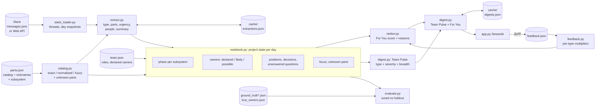

# Daily Digest

A daily Slack digest for a robotics hardware team. Each digest has two parts:

- **Team Pulse**: the same 3 items for everyone, so personalization doesn't split the team into silos.
- **For You**: what changed that matters to *this* person, with a plain-English reason for every item.

Actual output for one person on one day (`python -m digest_tool.digest 2026-09-17`; the LLM-written intro is
left out because the 2B model mentioned "production testing", which isn't in any item):

```
Ravi Menon · Thu Sep 17 · gripper EVT · wrist EVT · base EVT · power EVT · cabling EVT

Team Pulse
- Still open (#mech): Wrist motor overheating to 92°C at 45°C ambient; electrical engineer suspects
  driver current issues but retest shows margin too tight.
   - why: Open problem with no resolution yet (open since Tue Sep 15)

For You
1. New problem (#supply-chain): Supply chain is reporting an EOL notice for the J4 connector with a
   buy deadline of 11/30, requiring a decision on lead time or replacement before DVT.
   - why: You likely own the J4 connector (mentioned as "43045-0412"): you've mentioned it 1 time,
          answered 1 question about it, been asked about it once (not on the roster, inferred from activity)
   - why: Problems are a priority for mechanical engineers at this stage (cabling is in EVT)
   - why: Posted in #supply-chain, a channel you don't post in
```

Ravi isn't listed as the J4 owner and never reads #supply-chain. He gets the alert because the
catalog knows `43045-0412` is the J4 connector, and because two days earlier he answered Priya's
question about the "J-4 latch".

## The problem

A hardware team's Slack holds everything: thermal test results, vendor emails, design decisions,
lunch plans. Nobody reads all of it, and important messages often land where the right person
isn't looking. Supply chain posts that a connector is going end-of-life; the engineer who owns
that connector doesn't follow #supply-chain and finds out three weeks later.

What's relevant to someone depends on:

1. **Role.** Supply chain cares about decisions, because they turn into parts to buy. A PM cares about schedule.
2. **The stage of each subsystem.** The gripper can be frozen in DVT while the wrist is still in EVT. A change to a DVT subsystem needs an ECO; the same change in EVT is routine.
3. **Current focus.** It shifts. An engineer who moved from the gripper to the cable harness last week now needs harness news.

## Core idea: a project notebook, not a summarizer

The tool keeps a **project notebook** (the project's state) and updates it from Slack one day at a time:

- **parts catalog**: one official name per part, many nicknames. `J4`, `J-4`, `43045-0412`, `molex conector` and `wrist conn` all map to the *J4 connector*.
- **phase per subsystem**: gripper, wrist, base, power and cabling each have their own phase, read from ordinary messages ("design freeze for the gripper, the base and the harness … the wrist stays in EVT").
- **owners**: declared in `team.json` (about half left out on purpose), plus owners **inferred from activity**, each with a confidence level.
- **open problems, decisions, unanswered questions**, and **unknown parts** a human should add to the catalog
- **who's been working on what**: focus.

Each thread that changes the notebook produces a *change record*. A digest is built from change records, and each carries the reasons it scored. That's what makes **cross-team alerts** work:

- The end-of-life notice in #supply-chain names `43045-0412`.
- The catalog maps that to the J4 connector.
- The notebook has inferred Ravi as its likely owner, because he answered a question about the "J-4 latch".
- So the notice reaches Ravi, though he never reads that channel.

## What changed in V2 and why

| Change | Why |
|---|---|
| **Team Pulse + For You** | Personalization alone creates silos: everyone sees only their slice. The pulse gives everyone the same top 3 items (phase changes, schedule risks, major decisions), and For You never repeats them. |
| **Parts catalog with nicknames** (`parts.json`, `catalog.py`) | People call the same part by different names. Mapping every mention to one official name makes ownership and focus work at all. Fuzzy matching catches typos, and anything unrecognized is listed for a human to add. |
| **Phase per subsystem** | Real projects don't move in lockstep. "Problems matter to EMs in EVT" must use the wrist's phase for a wrist thread, not a global one. |
| **Inferred ownership** with confidence levels | Rosters are always incomplete. Activity fills the gaps, and the reason says how sure we are: *declared*, *likely* or *possible*. |
| **Holdout stories and honest reporting** | The V1 numbers were measured on the same stories used to tune the weights. Results are now reported separately for tuned and holdout stories, and holdout detail is hidden by default. |
| **👍/👎 feedback** | The weights are guesses. Votes adjust how much each *type* of item counts for that person, in a way that can be explained in one sentence. |
| **Cache key includes a content hash** | V1 keyed extractions by thread and message count only, so an edited message silently reused an old extraction. |

## Architecture



| File | What it does |
|---|---|
| `slack_loader.py` | `load_messages("fake" \| "slack")`, groups messages into threads, and shows a thread as of a given day |
| `catalog.py` | Nickname → official part name (exact, then punctuation-insensitive, then fuzzy for typos), and flags unknown parts |
| `extract.py` | One thread snapshot → type, parts (official names), unknown parts, urgency 1–5, people, summary. The LLM gets the catalog in its prompt; catalog matching is the backup and the cross-check |
| `notebook.py` | Replays the days in order: subsystem phases, owner inference, open items, focus, unknown parts |
| `ranker.py` | For You: scores each change for each person and returns the top 5 with reasons |
| `feedback.py` | 👍/👎 log → per-person, per-item-type multipliers; reset |
| `digest.py` | Team Pulse (shared) + For You (personal). An LLM writes the intro; items and reasons always come from code |
| `evaluate.py` | Alerts, Team Pulse, nicknames and ownership, for tuned and holdout separately |
| `app.py` | Streamlit: person, day, subsystem phase table, Team Pulse first, For You, 👍/👎 on every item, reset, focus chart, notebook view |

### What the LLM does, and what it doesn't

Code handles everything that has to be **reliable and explainable**:

- **Catalog matching**, including typos.
- **@-tags.**
- **"Unanswered for 48h"**, from reply timestamps.
- **Phase changes**, from phrases like "design freeze", "EVT build done", "DVT units shipped" and "stays in EVT", read one sentence at a time.
- **Ownership evidence.**

The LLM handles what needs language understanding:

- **The thread type**, its **urgency** and a **summary**.
- **Parts referred to indirectly.**
- **Part-like mentions that aren't in the catalog.**

Parts that only the LLM linked count for less, and their reason says so.

## How scoring works

### Ownership: declared, likely, possible

Each person gets an ownership score per part from evidence, with older evidence counting less (half-life 7 days):

| Evidence | Weight |
|---|---|
| Said something about the part | 1 |
| Asked about it (askers usually aren't owners) | 0.5 |
| **Answered someone else's question about it** | 2 |
| **Was @-tagged next to it** | 1.5 |

Each owner then gets a confidence level:

- **declared**: listed in `team.json`. This always wins.
- **likely**: a score of at least 3, and at least 40% of the evidence about that part.
- **possible**: a score of at least 1.5, and at least 25% of the evidence. This level only fills gaps: if the roster names an owner, weak evidence doesn't add another.

The reason in the digest says which kind it is, for example: *"You likely own the J4 connector (mentioned as "43045-0412"): you've mentioned it 1 time, answered 1 question about it, been asked about it once (not on the roster, inferred from activity)"*.

### For You

| Signal | Points | Reason shown |
|---|---|---|
| Declared owner of a part named in the thread | 5 | *You own the wrist assembly (mentioned as "wrist"), per the team roster* |
| Likely owner | 4 | *You likely own the J7 connector: … (inferred from activity)* |
| Possible owner | 2 | *You may own the battery pack: …* |
| Your part, linked only by the LLM | 2 | *… (linked by the LLM)* |
| Mentioned by first name | 2 | *You're mentioned by name* |
| Item type matters to your role **at the phase of the subsystem it touches** | 2 | *Problems are a priority for engineering managers at this stage (wrist is in EVT)* |
| Recent focus on a named part (2+ mentions this week, decayed) | up to 3 | *You've been working on the cable harness lately (5 mentions in the last week)* |
| Urgency | 0.5 per level above 2 | *Marked urgent (4/5)* |
| × your feedback for this item type | ×0.5 to ×1.5 | *You've rated updates 👍 0× / 👎 3×, so they count less for you (×0.7)* |

How the numbers are used:

- **Threshold:** an item needs 2.5 points.
- **Always included:**
  - you were `@`-tagged;
  - a question to you, or about your (declared or likely) part, has gone unanswered for 48h;
  - a problem with urgency 4 or higher is on your part;
  - a subsystem changed phase.
- **Top 5** items make For You, minus anything already in the pulse.

### Team Pulse

The Team Pulse holds the same top 3 items for everyone. Each change gets a pulse score:

> **type + severity + breadth**

- **Type:** phase change 8, schedule risk +6, major decision (urgency 4 or higher) 5, other problems and unanswered questions at most 1.
- **Severity:** the urgency rating.
- **Breadth:** the number of people it matters to, plus 0.5 per subsystem it touches.

An item needs a score of 12. Type dominates on purpose: a routine problem only makes the pulse if it is both severe and touches almost everyone. The pulse holds 0 to 3 items: only what clears the cutoff. A quiet day has an empty pulse rather than one padded with older open problems. Pulse items show a *for you* line when they also matter to you personally. Nobody's feedback changes the pulse, so it stays shared.

### Feedback

Every item, pulse or For You, has 👍/👎 buttons. A vote is recorded against the item's **type**:

> multiplier = 1 + 0.1 × (👍 − 👎), kept between 0.5 and 1.5, per person and per type

It's gentle, it's personal, and it can be explained in one sentence. "Reset feedback" in the sidebar clears it so the demo can be repeated.

## Running it

```bash
cd digest-tool
python3 -m venv .venv && source .venv/bin/activate
pip install -r requirements.txt

streamlit run app.py                           # the UI
pytest                                         # unit tests (tiny made-up inputs, no LLM, < 1 s)
python -m digest_tool.evaluate                 # results: tuned vs holdout (holdout detail hidden)
python -m digest_tool.evaluate --show-holdout  # ...including holdout per-event detail
python -m digest_tool.digest 2026-09-21        # all digests for one day in the terminal
python -m digest_tool.notebook                 # day-by-day state: phases, changes, owners, unknown parts
python -m digest_tool.catalog                  # nickname matching examples
python scripts/make_fake_data.py               # regenerate data/messages.json + ground truth
```

### Project layout

```
digest-tool/
  app.py                 Streamlit UI (entry point)
  digest_tool/           the library: config, slack_loader, catalog, extract, notebook,
                         ranker, feedback, digest, evaluate
  tests/                 pytest: catalog matching, phase detection, ownership inference
  scripts/
    make_fake_data.py    builds the fake dataset (messages + ground truth)
    sources/             story sources merged by the generator (incl. the holdout: don't read while tuning)
  data/                  team, parts catalog, messages, ground truth, cache
```

**No API key needed.** The default `LLM_PROVIDER=none` reads the committed cache in `data/cache/`,
which was generated with `claude-haiku-4-5` (extraction for all 69 thread snapshots + 45 intros, about
$0.25 in total). If you delete the cache, it still runs: keyword rules stand in for the LLM, and
templates stand in for the intros. An AI intro that names a number, person or part not in the
digest's items is replaced by the template.

**With an LLM**, set `LLM_PROVIDER=ollama` (local) or `LLM_PROVIDER=anthropic` (with
`ANTHROPIC_API_KEY`) in `.env`, then run `python -m digest_tool.extract` and `python -m digest_tool.digest all` to fill in
anything that isn't cached. `python -m digest_tool.extract anthropic --estimate` shows what an
uncached run would cost first, and `--limit 5` runs a small paid test. Tested on Python 3.9;
Python 3.11 is recommended.

## Connecting real Slack

`MESSAGE_SOURCE=slack` calls the Slack Web API with `SLACK_BOT_TOKEN`:

- `conversations.list` lists the channels.
- `conversations.history` fetches each channel the bot has joined.
- `conversations.replies` fetches the replies for every message that has them.

All three calls follow cursor pagination. Scopes needed: `channels:read` and `channels:history`.
Messages keep Slack's own fields, so nothing downstream changes. This path hasn't been run against
a real workspace.

## Evaluation

There are two ground-truth files:

- **Tuned:** `ground_truth.json`, with 20 events, 30 expected alerts and 16 labelled nickname mentions.
  - Stories 1–5 were written alongside the code.
  - The F-stories were the previous round's holdout. Once I'd seen their results they were spent, so they became tuned data.
- **Holdout:** `ground_truth_holdout.json`, with 4 events, 6 expected alerts and 7 labelled mentions. These are 2 stories written by a separate agent.
  - Its brief forbade opening any code, the ground truth, `team.json` or `true_owners.json`.
  - The file stayed sealed (unread, and not merged) while I tuned. I merged it once, after freezing the scoring, and changed nothing afterwards.
  - `evaluate.py` hides holdout per-event detail unless asked.
  - One leak: the agent's environment loads this project's `CLAUDE.md` automatically. It was told to ignore it, but it could have seen the project overview.

`python -m digest_tool.evaluate` reports the following.

**1. Alerts.** *Seen* = in the person's digest that day (pulse or For You). Precision is measured on For You.

| Tuned (30 alerts) | Seen recall | For You recall | For You precision | Items / person / day |
|---|---|---|---|---|
| **Ours (LLM extraction)** | **87%** | 47% | 61% | 2.5 |
| Ours (keywords only) | 87% | 53% | 67% | 3.2 |
| Everyone gets everything | 100% | 100% | 26% | 3.5 |
| Role only | 53% | 53% | 70% | 0.4 |

| Holdout (6 alerts) | Seen recall | For You recall | For You precision | Items / person / day |
|---|---|---|---|---|
| **Ours (LLM extraction)** | **83%** | 50% | 75% | 2.5 |
| Ours (keywords only) | 67% | 67% | 44% | 3.2 |
| Everyone gets everything | 100% | 100% | 29% | 3.5 |
| Role only | 0% | 0% | – | 0.4 |

**2. Team Pulse.** Did whole-team items reach the pulse, and did personal ones stay out?

| | Team-wide items in pulse | Personal items in pulse | Noise in pulse |
|---|---|---|---|
| Tuned, LLM | 4/4 | 1/16 | 0 |
| Holdout, LLM | 1/1 | 0/3 | 0 |
| Holdout, keywords only | 0/1 | 0/3 | 0 |

**3. Nicknames.** Mentions mapped to the right official part.

| | Catalog matcher | LLM | Either | Unknown parts flagged |
|---|---|---|---|---|
| Tuned | 13/13 | 10/13 | 13/13 | 3/3 |
| Holdout | 4/6 | 5/6 | 5/6 | 0/1 |

**4. Ownership** vs `true_owners.json` (19 parts and topics; 11 of the 21 true owner pairs are hidden from `team.json`).

| Owners counted | Precision | Recall | Hidden owners found |
|---|---|---|---|
| Declared only | 100% | 48% | 0/11 |
| + likely | 100% | 62% | 3/11 |
| + possible | 76% | 76% | 6/11 |

### What the numbers say

- **The holdout is tiny.** 6 alerts means a single miss moves recall by 17 points. Treat the holdout numbers as a smoke test, not a measurement.
- **Holdout results were similar to tuned on seen recall** (83% vs 87%), which suggests the tuning isn't purely memorized. The holdout is too small to be sure.
- **The LLM helped on the holdout but not on the tuned set.** On the tuned set, keyword extraction matches the 2B model. On the holdout, the LLM beat keywords on seen recall (83% vs 67%) and precision (75% vs 44%). The LLM also mapped a nickname the catalog didn't know (5/6 vs 4/6).
- **Unknown-part detection missed the holdout's out-of-catalog part (0/1).** The pattern backup only catches part numbers and "<word> <hardware word>" phrases.
- **Role-only filtering is useless on the holdout.** Ownership and catalog matching do the real work.
- **Ownership:** *likely* is trustworthy (no wrong owners), and *possible* is a mixed bag, which is why it's weighted lower and its reason says "may own". Some true owners are never found:
  - **the wrist motor**, because nobody names it, they say "wrist";
  - **the slew bearing**, which was mentioned once.

## Assumptions & Limitations

- **I wrote the tuned test data myself,** along with the weights, the catalog and the ground truth. The holdout came from a separate agent, but it's very small, and that agent could see this project's `CLAUDE.md`.
- **The scoring weights are starting guesses.** The thresholds (2.5 for For You, 12 for the pulse, the ownership cut-offs) were tuned by looking at tuned-set results. Feedback adjusts item types per person, not the underlying weights.
- **The dataset is small:** 103 messages, 5 people and 2 weeks. A real team produces that in an hour. Volume figures (items/day) say little about a real workspace.
- **Ownership inference is simple:** counting mentions, answers and @-tags with decay. It confuses *doing the work* with *owning the part*, and supply chain or managers sometimes look like owners because they talk about everything.
- **Phase detection is pattern-based.** It understands "design freeze", "EVT build done", "officially in DVT" and "stays in EVT", but not "we're good to start PVT next sprint".
- **Fuzzy matching** catches small typos in nicknames of 6 or more characters. It won't catch new nicknames; those go to the unknown-parts list, but only when they look like a part number or a "<word> <hardware word>" phrase.
- **The 2B local model** sometimes mislabels thread types, and its intros can include things that aren't in the items. Intros are cleaned, and fall back to a template when they look wrong.
- **Problems close only through a decision in the same thread.** Cross-thread resolution (the driver switch fixing the overheating) isn't detected.
- **Not tested here:** the Anthropic provider and the live Slack connection.

## Next steps

- **Real Slack connection:** a bot in the workspace, a morning run per person, and the digest delivered as a DM with 👍/👎 as message buttons.
- **Live alerts:** don't wait for the morning for *must-include* items (you're blocked, a phase change, your part going EOL); send them as they happen.
- **Learn the weights from more feedback:** with enough votes, fit the per-signal weights per role, check them against a fresh holdout every few weeks, and retire each holdout once its results have been looked at.
- **Build the catalog from the BOM/PLM system:** part numbers, official names and owners from the source of truth, with the unknown-parts list as a review queue (the LLM proposes "arm umbilical → cable harness", and a human approves it).
- **Better ownership signals:** ECO authorship, drawing owners in PDM, and who closes the problems.
- **Process rules per phase:** flag "change to a DVT subsystem without an ECO".
- **A bigger model, plus an extraction-level eval**, so misses can be traced to extraction or to scoring.
